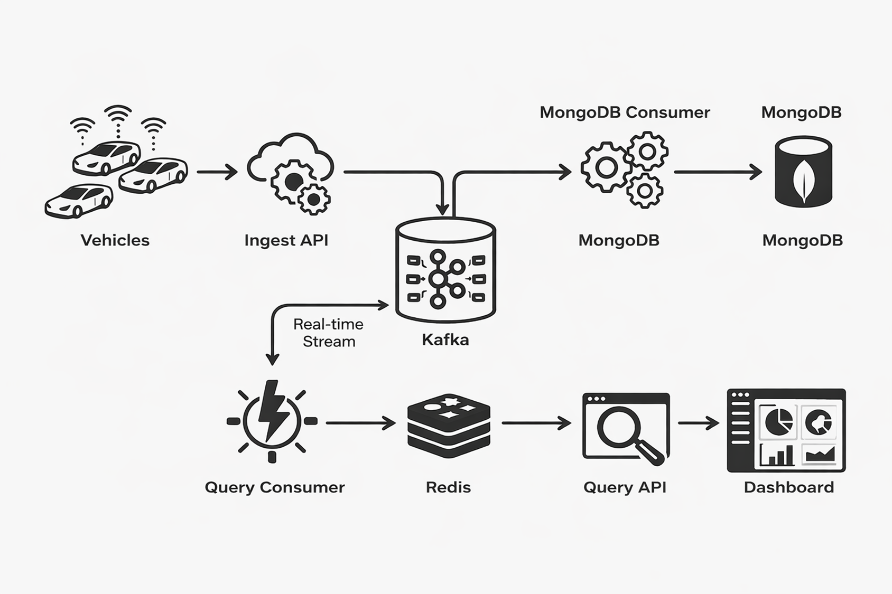
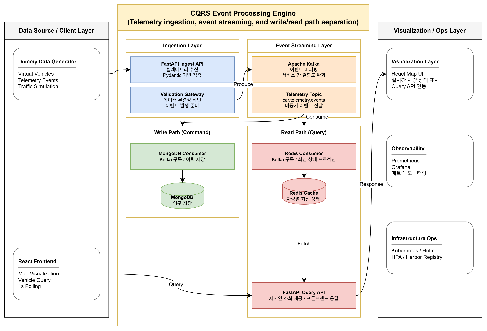
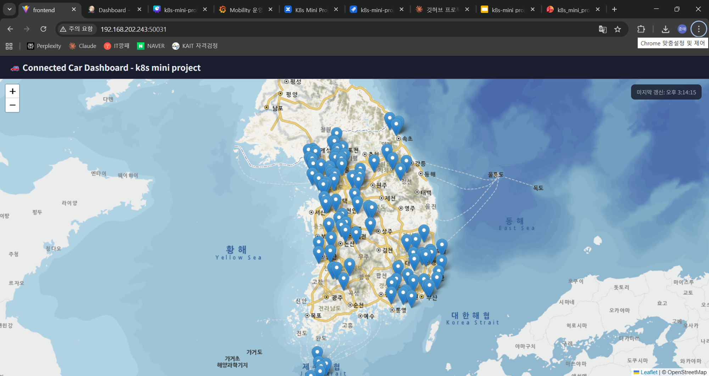

# Connected Car Telemetry System

차량 텔레메트리 데이터를 실시간으로 수집·저장·조회하기 위해, CQRS 기반으로 읽기와 쓰기 경로를 분리한 모빌리티 관제형 클라우드 시스템입니다.

---
**데이터 흐름**

---
**세부 아키텍처**

---

## 1. 프로젝트 개요

차량 텔레메트리 데이터는 지속적으로 대량 유입되며, 관제 서비스에서는 현재 차량 상태를 빠르게 조회하는 기능과 전체 이력을 안정적으로 저장하는 기능이 동시에 필요합니다.  
이 프로젝트는 이러한 요구사항을 해결하기 위해 **CQRS 기반 아키텍처**를 적용하고, **Kafka를 중심으로 Command와 Query 경로를 분리**해 실시간성과 확장성을 함께 확보하고자 설계한 시스템입니다.

시스템은 차량 데이터를 수신하는 Ingest API, 이벤트를 비동기 처리하는 Kafka, 전체 이력을 저장하는 MongoDB, 차량별 최신 상태를 유지하는 Redis, 그리고 이를 시각화하는 React 프론트엔드로 구성했습니다.  
또한 Kubernetes, Helm, Harbor, Jenkins, Prometheus, Grafana, Alertmanager를 포함해 단순 기능 구현을 넘어서 **운영 환경을 고려한 구조**로 확장했습니다.

### 기간 / 형태

- **기간:** 2026.02.24 ~ 2026.03.13
- **과정:** 현대오토에버 모빌리티스쿨 클라우드 트랙 3기
- **형태:** 4인 팀 프로젝트

### 한 줄 소개

CQRS, Kafka, Redis, MongoDB, Kubernetes를 활용해 차량 텔레메트리 데이터를 실시간 처리하고 시각화한 모빌리티 관제형 클라우드 시스템

---

## 2. 진행 배경 및 문제 정의

차량 텔레메트리 데이터는 지속적으로 대량 유입되며, 저장과 조회가 동시에 발생할 경우 단일 데이터 저장소만으로는 병목이 발생할 수 있습니다.

특히 관제 화면에서는 차량의 **최신 상태를 빠르게 조회**해야 하고, 동시에 전체 텔레메트리 이력은 **안정적으로 누적 저장**되어야 했습니다.  
이 두 요구사항을 하나의 경로로 처리하면 조회 성능과 저장 안정성을 모두 만족시키기 어렵다고 판단했습니다.

이를 해결하기 위해 다음과 같은 방향으로 시스템을 설계했습니다.

- **쓰기 경로와 읽기 경로를 분리**해 부하를 분산할 것
- **최신 상태 조회는 Redis**를 활용해 응답 속도를 높일 것
- **전체 이력은 MongoDB**에 저장해 Source of Truth 역할을 부여할 것
- **Kubernetes 기반 배포, 모니터링, 인증 설정**까지 포함해 운영 가능한 구조를 만들 것

---

## 3. 시스템 아키텍처

시스템은 크게 **Command Side**, **Query Side**, **Presentation Layer**, **Infrastructure / Operations**로 구성했습니다.

### 1) Command Side

- Dummy Data Generator가 차량 데이터를 생성
- FastAPI 기반 **Ingest API**가 차량 상태 데이터를 수신하고 검증
- 수신된 데이터는 **Kafka 토픽**으로 발행
- **MongoDB Consumer**가 전체 이력을 저장

이 경로는 지속적으로 유입되는 차량 데이터를 안정적으로 적재하는 역할을 담당합니다.

### 2) Query Side

- **Redis Consumer**가 Kafka 이벤트를 소비
- 차량별 최신 상태만 **Redis**에 TTL 기반으로 저장
- **FastAPI Query API**가 Redis에서 상태를 조회

이 경로는 관제 화면에서 필요한 최신 차량 상태를 빠르게 응답하기 위한 조회 전용 경로입니다.

### 3) Presentation Layer

- **React 프론트엔드**가 Query API를 호출
- 지도 기반 UI에서 차량 상태를 시각화
- Leaflet과 VWorld 지도를 활용해 차량 위치와 상태를 표현

### 4) Infrastructure / Operations

- **Kubernetes / Helm / Ingress** 기반 배포
- **Harbor** 사설 레지스트리 운영
- **Jenkins**를 통한 이미지 빌드 및 배포 흐름 구성
- **Prometheus / Grafana / Alertmanager** 기반 모니터링
- **NFS Storage**를 통한 데이터 영속성 확보

---

## 4. 사용 기술

### Backend
- Python
- FastAPI
- Pydantic

### Messaging / Data
- Apache Kafka
- MongoDB
- Redis

### Infra / Platform
- Kubernetes
- Helm
- Nginx Ingress
- Harbor
- Jenkins
- NFS Storage

### Monitoring
- Prometheus
- Grafana
- Alertmanager

### Frontend
- React

---

## 5. 담당 역할

프로젝트에서 다음 영역을 담당했습니다.

- Harbor 사설 레지스트리 구축
- Redis 연동 및 Query 구조 반영
- React 프론트엔드 설계 및 구축
- Kafka 일부 수정 및 Redis 연계 로직 반영
- Grafana 일부 설정
- 네트워크 일부 설정

### 기여 내용 상세

Redis를 활용해 차량의 최신 상태를 빠르게 조회할 수 있는 구조를 반영했습니다.  
이를 통해 전체 이력 저장 경로와 최신 상태 조회 경로를 분리하는 CQRS 구조가 실제 서비스 흐름에 맞게 동작하도록 보완했습니다.

또한 React 프론트엔드에서 Query API를 통해 차량 상태를 조회하고, 지도 기반으로 시각화할 수 있도록 구성했습니다.  
Harbor를 구축하여 내부 이미지 저장 및 배포 환경을 마련했고, Grafana 일부 설정을 통해 시스템 상태를 확인할 수 있는 운영 기반도 보완했습니다.

---

## 6. 핵심 설계 포인트

### 1) CQRS 기반 읽기/쓰기 분리

저장과 조회를 하나의 경로로 처리하지 않고, Kafka를 중심으로 **Command Side**와 **Query Side**를 분리했습니다.  
이를 통해 이력 저장과 실시간 조회 요구를 서로 다른 저장 전략으로 처리할 수 있도록 했습니다.

### 2) Redis 기반 최신 상태 조회

관제 화면은 과거 이력보다 **현재 차량 상태를 빠르게 조회**하는 것이 중요했기 때문에, Redis에 차량별 최신 상태만 유지하는 구조를 적용했습니다.

### 3) MongoDB 기반 이력 저장

MongoDB를 **Source of Truth / Historical Store**로 사용해 전체 텔레메트리 이력을 누적 저장하도록 구성했습니다.  
이 구조를 통해 조회 최적화와 이력 보존 목적을 분리할 수 있었습니다.

### 4) 운영 환경을 고려한 구조

단순 기능 구현에 그치지 않고, Kubernetes 환경에서의 배포와 모니터링, 사설 레지스트리 운영, 인증 설정, 스토리지 지속성까지 함께 고려했습니다.

---

## 7. 트러블슈팅

### 1) Secret 적용 후 MongoDB 인증 실패

#### 문제
Secret을 추가한 뒤 MongoDB 인증이 실패하여 애플리케이션이 데이터베이스에 연결되지 않는 문제가 발생했습니다.

#### 원인
`secret.yaml`의 namespace가 `default`로 지정되어 있어, 실제 서비스가 배포된 네임스페이스의 Pod에 Secret이 정상적으로 주입되지 않았습니다.  
또한 인증 관련 설정이 일부 리소스에 일관되게 반영되지 않았습니다.

#### 해결
Secret의 namespace를 실제 배포 네임스페이스에 맞게 수정하고, StatefulSet과 관련 설정에 인증 옵션을 다시 반영한 뒤 재배포하여 문제를 해결했습니다.

#### 배운 점
Kubernetes 환경에서는 애플리케이션 설정 자체보다도, **네임스페이스·Secret 주입·배포 리소스 간 연결 관계**가 정상적으로 맞물리는지가 매우 중요하다는 점을 확인했습니다.

### 2) Harbor와 Jenkins 간 통신 오류

#### 문제
Harbor와 Jenkins를 연동하는 과정에서 이미지 푸시 및 배포 흐름에서 통신 오류가 발생했습니다.

#### 원인
네트워크 환경 차이와 HTTP/HTTPS 설정 차이로 인해 레지스트리 접근이 불안정했고, 일부 환경에서는 인증 및 통신 설정이 일관되지 않았습니다.

#### 해결
Harbor를 Offline Installer 기반으로 재구성하고, 필요한 구간에는 insecure registry 설정을 반영해 이미지 푸시와 배포 흐름이 정상적으로 동작하도록 조정했습니다.

#### 배운 점
배포 자동화는 도구를 연결하는 것만으로 끝나는 것이 아니라, **레지스트리 접근 방식·네트워크 정책·프로토콜 설정**까지 함께 맞춰야 안정적으로 운영할 수 있다는 점을 배웠습니다.

---

## 8. 운영 관점에서 고려한 요소

- 파드 재시작 이후에도 데이터가 유지되도록 **영속 저장소**를 고려했습니다.
- Redis에는 최신 상태만 유지하고, MongoDB에는 전체 이력을 저장하는 방식으로 **저장 목적을 분리**했습니다.
- Prometheus / Grafana / Alertmanager 기반으로 **모니터링 및 운영 가시성 확보**를 목표로 구성했습니다.
- Harbor, Jenkins, Helm을 통해 **배포와 이미지 관리 흐름**을 운영 관점에서 정리했습니다.
- 서비스 확장 가능성을 고려해 **Kubernetes 기반 구조**로 설계했습니다.

---

## 9. 결과 및 한계

### 결과

- CQRS 기반의 읽기/쓰기 분리 구조를 실제 서비스 흐름에 적용했습니다.
- Kafka, MongoDB, Redis를 활용해 **이력 저장과 최신 상태 조회를 분리한 데이터 파이프라인**을 구현했습니다.
- Kubernetes, Harbor, Jenkins, Grafana 등 운영 요소를 포함한 **클라우드 시스템 구성 경험**을 확보했습니다.
- 내부 네트워크 환경에서 시스템 동작을 확인하고 시연까지 진행했습니다.

### 한계

- 교육기관 내 외부 포트포워딩 작업이 지연되어, **외부 공개 환경에서의 접근 검증**까지는 진행하지 못했습니다.
- 실제 외부 사용자 접속 시나리오와 공인 네트워크 환경 검증은 후속 과제로 남았습니다.
- 부하 테스트를 통한 정량적 확장성 검증은 충분히 수행하지 못했습니다.

### 개선 방향

- 외부 Ingress 및 DNS 연동을 통해 외부 접근 가능한 형태로 확장
- HTTPS 적용 및 레지스트리/서비스 보안 설정 강화
- 모니터링 범위와 알림 정책 구체화
- 부하 테스트를 통한 확장성 검증

---
