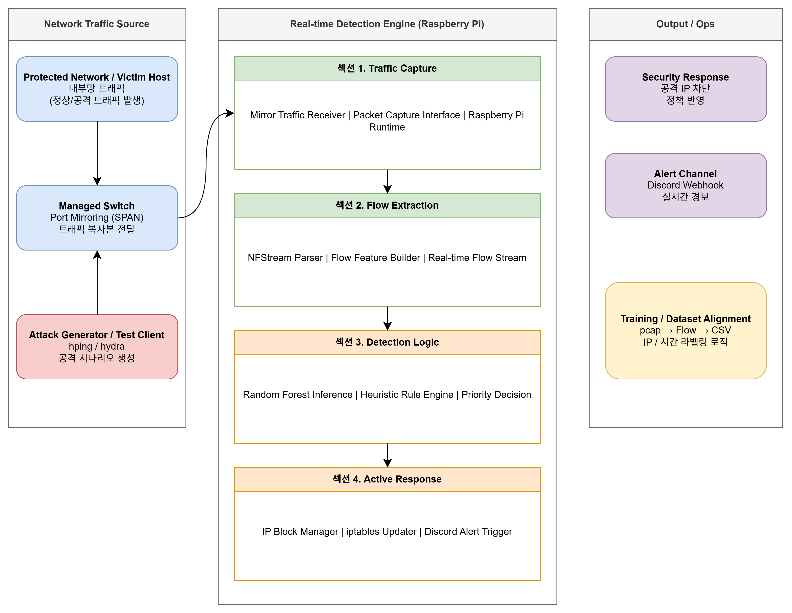

# AI 기반 실시간 네트워크 이상 트래픽 감시 시스템 (IPS)

NFStream 기반 Flow 분석과 머신러닝을 활용해 네트워크 공격을 실시간으로 탐지하고 자동 차단하는 시스템입니다.

---

---
## 1. 프로젝트 개요

기존의 룰 기반 보안 시스템은 사전에 정의된 조건에는 빠르게 반응할 수 있지만, 변형되거나 새롭게 나타나는 공격 패턴에는 유연하게 대응하기 어렵습니다.

이 프로젝트는 네트워크 트래픽을 **패킷 단위가 아닌 Flow 단위**로 분석하고, 머신러닝 모델과 휴리스틱 규칙을 결합해 **DDoS, Port Scan, Brute Force** 공격을 실시간으로 탐지하고 자동 차단하는 시스템을 구현한 프로젝트입니다.

시스템은 Managed Switch의 포트 미러링을 통해 트래픽 복사본을 수집하고, Raspberry Pi에서 NFStream으로 Flow 특징값을 생성한 뒤, Random Forest 모델과 규칙 기반 로직을 통해 공격 여부를 판단합니다. 이후 공격으로 판정된 IP는 `iptables`로 차단하고, Discord Webhook을 통해 경보를 전송하는 구조로 설계했습니다.

### 기간 / 형태

- **기간:** 2025.10.10 ~ 2025.12.19
- **형태:** 4인 팀 프로젝트

### 한 줄 소개

NFStream으로 패킷을 Flow 특징 데이터로 변환하고, Random Forest와 휴리스틱 규칙을 결합해 네트워크 공격을 실시간 탐지·차단하는 AI 기반 IPS 시스템

---

## 2. 문제 정의

기존 보안 시스템은 주로 시그니처나 고정 규칙 기반으로 동작하기 때문에, 공격 패턴이 조금만 달라져도 탐지 성능이 떨어질 수 있습니다. 특히 DDoS, Port Scan, Brute Force처럼 짧은 시간 안에 다량의 연결 시도가 발생하는 공격은 단순 규칙만으로 정확도와 실시간성을 동시에 확보하기 어렵습니다.

이를 해결하기 위해 본 프로젝트는 다음과 같은 방향으로 설계되었습니다.

- 패킷 단위가 아닌 **Flow 기반 분석 구조** 적용
- 머신러닝 기반으로 공격 패턴 일반화
- AI 단독 판단의 오탐을 줄이기 위한 **휴리스틱 규칙 결합**
- 탐지 이후 실제 대응까지 이어지는 **자동 차단 및 알림 체계 구현**
- Raspberry Pi 환경에서도 실행 가능한 **경량 모델 기반 설계**

---

## 3. 시스템 아키텍처

시스템은 크게 **트래픽 수집 → Flow 변환 → ML 추론 → 우선순위 판정 → 자동 대응** 단계로 구성됩니다.

### 1) Traffic Capture
Managed Switch의 **Port Mirroring(SPAN)** 기능을 이용해 네트워크 트래픽 복사본을 Raspberry Pi로 전달합니다. 보호 대상 장비를 지나는 트래픽이 분석 장치로 미러링되는 구조입니다.

### 2) Flow Extraction
수집된 원시 패킷은 **NFStream**을 통해 분석 가능한 Flow 특징 데이터로 변환됩니다. 이 과정에서 목적지 포트, 패킷 수, 지속 시간, 평균 패킷 크기 등 다양한 특징값이 생성됩니다.

### 3) ML Inference
변환된 Flow 데이터는 사전 학습된 **Random Forest** 모델에 입력되어 정상/이상 여부를 예측합니다. Random Forest는 자원이 제한된 Raspberry Pi에서도 실행 가능하도록 경량성과 해석 가능성을 고려해 선택했습니다.

### 4) Priority Logic
모델의 예측 결과만으로 최종 판정을 내리지 않고, Port Scan과 Brute Force 등에 대해 하드코딩된 휴리스틱 규칙을 함께 적용해 최종 공격 여부를 결정합니다.

예시:
- **Port Scan**: 1초 내 10개 이상의 서로 다른 포트 접속 시도
- **Brute Force**: 21/22번 포트에 대한 단시간 반복 접속 시도
- **DDoS**: 특정 포트 및 연결 빈도 급증 패턴 반영

### 5) Active Response
공격으로 판정된 경우 `iptables` 규칙을 갱신해 해당 IP를 차단하고, 동시에 Discord Webhook을 통해 경보를 전송합니다.

---

## 4. 사용 기술

### Language / Backend
- Python 3

### ML / Data
- Pandas
- Scikit-learn
- Random Forest
- Joblib

### Network Analysis
- NFStream / NFStreamer

### Infra / Security
- Raspberry Pi 4
- TP-Link 관리자형 스위치
- iptables
- Discord Webhook

### Dataset / Test
- CIC-IDS-2017
- Friday-WorkingHours.pcap
- hping
- hydra

---

## 5. 기여 및 담당 역할

프로젝트에서 다음 역할을 담당했습니다.

- Raspberry Pi, 네트워크 스위치, 노트북 간 내부망 구성
- Managed Switch 포트 미러링 기반 트래픽 수집 환경 설정
- Raspberry Pi 구동 및 실행 환경 설정
- `pcap → Flow` 변환 및 학습용 CSV 생성
- NFStream 입력 처리
- 공격자 IP / 시간 기준 라벨링 로직 작성
- 공격 탐지 기능 일부 구현
- 테스트 공격 트래픽 실행 및 검증 환경 구성

### 역할 상세

특히 본 프로젝트에서는 **실시간 탐지 시스템과 동일한 입력 구조를 갖는 학습 데이터를 만드는 과정**에 직접 기여했습니다.

원본 `pcap` 데이터를 NFStream으로 다시 처리해 Flow 단위 특징 데이터로 변환하고, 공격자 IP와 시간 정보를 기준으로 라벨링 로직을 작성하여 학습용 CSV를 생성했습니다.

또한 Raspberry Pi, 관리자형 스위치, 노트북 간 내부망을 구성하고, 포트 미러링을 통해 Raspberry Pi가 트래픽 복사본을 수신하도록 설정했습니다. 이후 NFStream 입력 처리와 실시간 탐지 기능 일부 구현에 참여해 실제 탐지 파이프라인이 동작할 수 있도록 연결했습니다.

---

## 6. 핵심 설계 포인트

### 1) Flow 기반 분석 구조
패킷 단위가 아니라 Flow 단위 특징값을 사용함으로써, 공격 패턴을 개별 패킷이 아닌 연결 특성 수준에서 파악할 수 있도록 설계했습니다. 이를 통해 실시간 시스템과 학습 데이터의 구조를 일치시키고, 일반화된 공격 탐지가 가능하도록 했습니다.

### 2) AI + 휴리스틱 결합 구조
머신러닝 모델 단독으로는 실환경에서 오탐 가능성이 존재하기 때문에, 공격 유형별 휴리스틱 규칙을 함께 적용해 신뢰도를 높였습니다.

### 3) 저사양 환경 고려
Raspberry Pi 환경에서도 실행 가능하도록 비교적 경량이면서도 해석 가능한 Random Forest를 선택했습니다.

### 4) 탐지 이후 자동 대응
탐지 결과를 단순히 화면에 출력하는 데서 끝내지 않고, `iptables` 차단과 Discord 경보까지 연결해 운영 관점의 대응 흐름을 만들었습니다.

---

## 7. 트러블슈팅

### 1) 패킷 기반 원본 데이터와 Flow 기반 실시간 시스템 간 구조 불일치

실시간 탐지 시스템은 NFStream 기반의 Flow 데이터를 입력으로 사용했기 때문에, 학습 데이터 역시 동일한 구조여야 했습니다. 그러나 CIC-IDS-2017의 Friday-WorkingHours 데이터는 원본이 CICFlowMetor 기반 스캔 데이터 였고, 이 상태로는 실시간 시스템과 직접 호환되지 않았습니다.

이를 해결하기 위해 Friday 원본 형태의 pcap 파일을 NFStream에 다시 입력해 새롭게 Flow를 생성했고, NFStream이 추출하는 특징값 구조를 기준으로 학습용 CSV를 다시 구성했습니다. 이 과정에서 공격자 IP와 시간 기준 라벨링 로직까지 함께 작성해, 학습 데이터와 실시간 입력 구조를 일치시킬 수 있었습니다.

### 2) 기존 학습 방식의 오탐률 증가와 실시간 지연 문제

기존 엑셀 데이터 기준으로 학습했을 때는 공격 종류가 추가될수록 오탐률이 크게 증가했습니다. 이를 줄이기 위해 몇 초 동안 들어온 신호를 묶어서 판단하는 방식을 시도했지만, 이 경우 최소 수 초의 지연이 발생했고 일부 공격은 실시간으로 탐지되지 않는 문제가 있었습니다.

이를 해결하기 위해 NFStream을 활용해 실시간 시스템과 동일한 Flow 구조로 데이터를 재구성하고 다시 학습했습니다. 그 결과 오탐을 줄이면서도 실시간 탐지에 더 적합한 구조를 만들 수 있었습니다.

### 3) Raspberry Pi-스위치-노트북 간 내부망 및 미러링 설정 문제

실제 장비를 연결하는 과정에서 Raspberry Pi, 스위치, 노트북 간 내부망 구성이 여러 번 꼬였고, 포트 미러링 설정과 각 장비의 네트워크 구성을 맞추는 데 시행착오가 있었습니다.

특히 관리자형 스위치에서 Raspberry Pi가 연결된 포트로 트래픽이 정상적으로 미러링되도록 설정하고, 각 장비의 IP 및 통신 상태를 함께 맞춰야 했기 때문에 소프트웨어보다 하드웨어와 네트워크 환경 설정의 영향이 더 크게 작용했습니다.

이 경험을 통해 실시간 보안 시스템은 모델 성능만이 아니라, **실제 트래픽을 안정적으로 수집할 수 있는 네트워크 환경 구성 자체가 핵심**이라는 점을 확인할 수 있었습니다.

---

## 8. 테스트 및 검증 방식

실제 공격 탐지 기능 검증을 위해 다음과 같은 테스트를 진행했습니다.

- **hping**을 이용한 대량 트래픽/공격 시뮬레이션
- **hydra**를 이용한 Brute Force 공격 시나리오 테스트
- 포트 미러링된 트래픽이 Raspberry Pi로 정상 전달되는지 확인
- 실시간 탐지 후 `iptables` 차단 및 Discord 알림 동작 여부 점검

---

## 9. 실행 방법

### 1) 데이터 준비 및 학습
`Friday-WorkingHours.pcap` 파일을 기반으로 공격자 IP와 시간을 매칭하여 라벨링된 학습 데이터를 생성합니다.

```bash
python 1_create_multiclass_data.py
python 2_train_model.py
```

### 2) 실시간 탐지 실행
수집 인터페이스(`eth0` 등)를 지정하여 실시간 모니터링을 시작합니다.

```bash
sudo python 3_realtime_detect_7.py
```

---

## 10. 프로젝트 성과

- Flow 기반 실시간 트래픽 분석 파이프라인 구성
- `pcap → Flow → CSV` 학습 데이터 생성 구조 정비
- 공격자 IP / 시간 기준 라벨링 로직 작성
- Random Forest와 휴리스틱 규칙을 결합한 하이브리드 탐지 구조 구현
- `iptables` 자동 차단 및 Discord 경보 연동
- Raspberry Pi와 관리자형 스위치를 활용한 실제 장비 기반 테스트 환경 구축

---

## 11. 아쉬운 점 및 한계

- 경험과 시간 부족으로 인해 **모니터링 시스템 구축까지는 확장하지 못했습니다**
- 한정된 공격 시나리오만으로 테스트를 진행해 **공격 다양성이 충분하지 않았습니다**
- 보안 및 권한 문제로 인해 **실제 운영 네트워크 환경에서 테스트하지 못했습니다**
- 현재 기준으로는 **정량 성능 지표(정확도, Precision, Recall, F1-score, Confusion Matrix)** 가 문서화되어 있지 않습니다

---

## 12. 개선 방향

- 모니터링 대시보드 구축
- 실제 운영 환경에 가까운 테스트 환경 확장
- 공격 유형 다양화 및 검증 시나리오 보강
- 성능 지표 정리 및 시각화
- 차단 해제, 화이트리스트 등 운영 매뉴얼 보완
